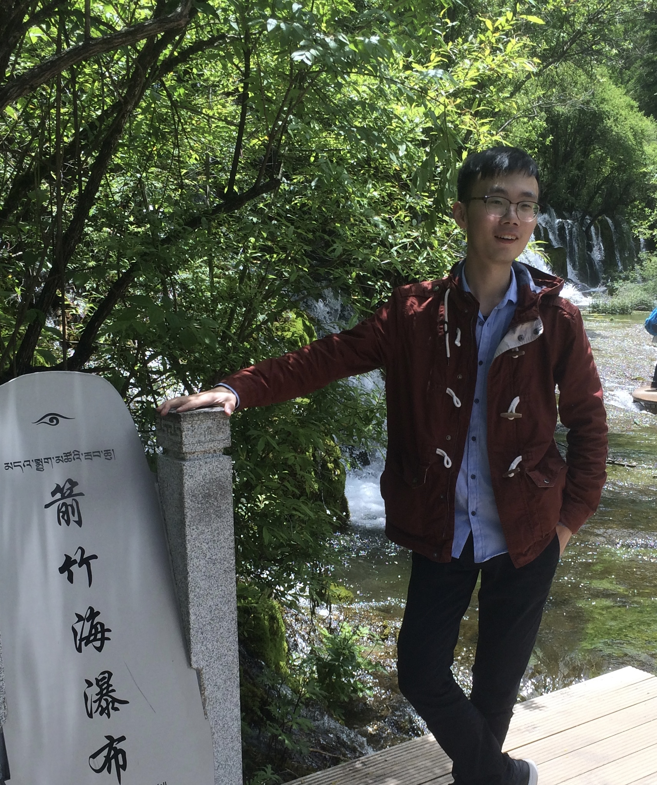

### A Little Background

<table>
  <tr>
    <td >Currently attending OSU as a senior in major of Computer Sience. I have worked in back-end development for two and half years prior to OSU. I am familiar with languages such as Java, Python, Javascript, etc., and have some knowledge of distributed systems. For now, I am interested in computer vision which a subfield of AI. For the detial could be found in my resume (<a href="/pdfs/Jingming_Resume.pdf">click to download</a>).</td>
    <td></img></td>
  </tr>
</table> 

### Ongoing Projects
- [Artificial Intelligence Incident Database (AIID)](https://github.com/responsible-ai-collaborative/aiid)
    *The codebase was extended to support the construction of the deepfake website based on the original AIID project. Currently, I am responsible for the back-end development of the extensions, which include the hosting of video and image media files, indexing of deepfake data, design and storage of video data structures, etc.*

### Past Projects
- [Meeting Reservation]()
    *Design the UI of the software and the implementation of the related components. Record the meeting data content and implement the back-end meeting management, etc.*

- [YunSu Website 2.0]()
    *Refactoring the 1.0 backend management system using a distributed system. My work was designed to include data migration, data structure expansion for new requirements, and implementation of backend related functions*